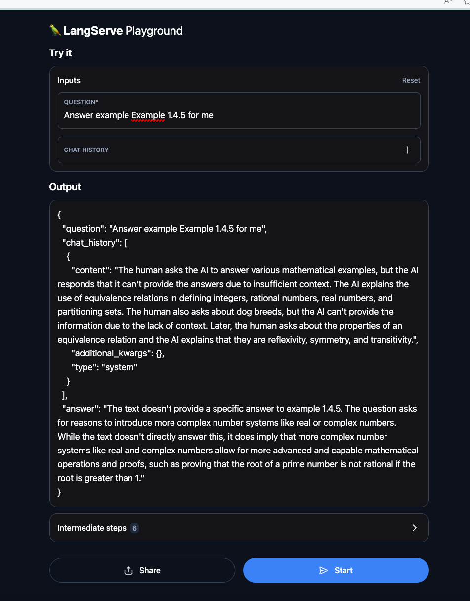
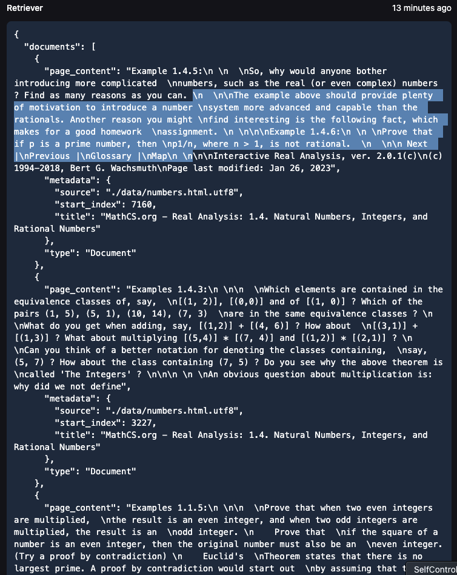
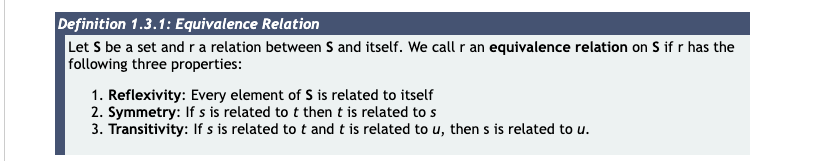
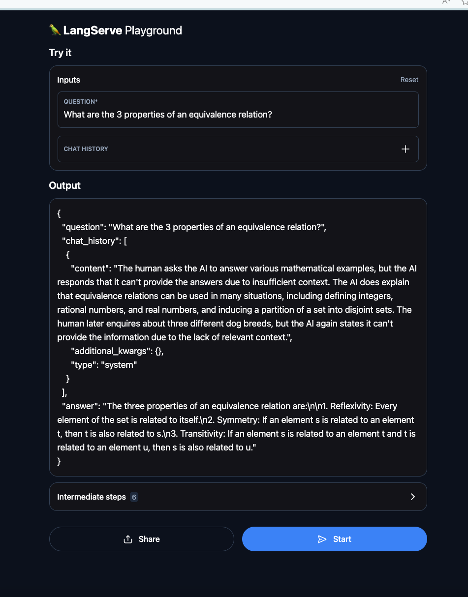
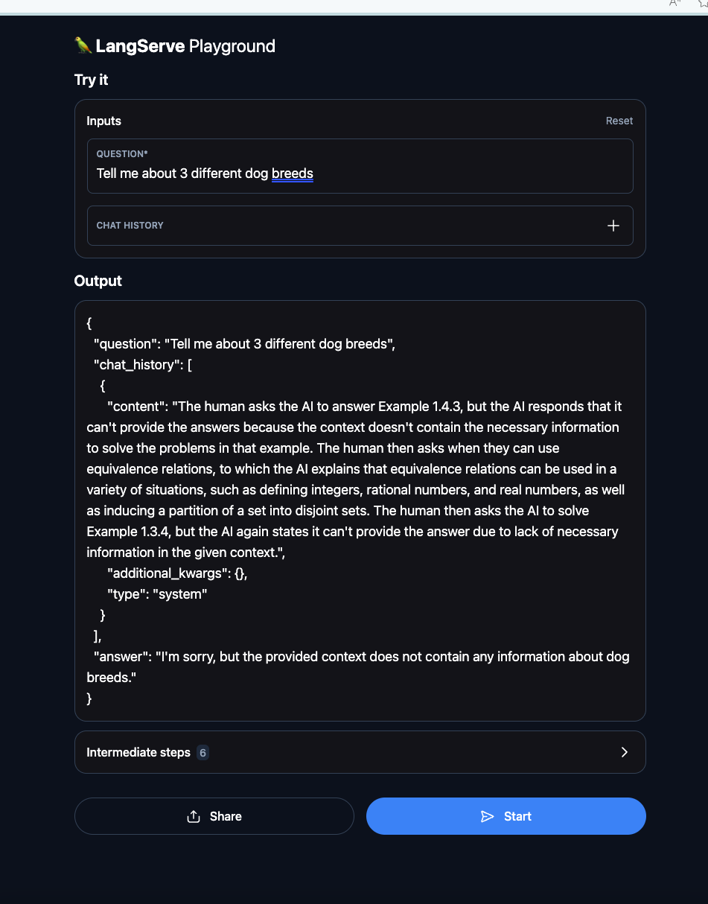

# LangChain Math Real Analysis Helper

This project is a LangChain prompt engineering application. The vision for this project is to load a bunch of real analysis math html files from a website, extract their info using Beautiful Soup LangChain HTML loader, break the material into chunks, and use ChatOpenAI to interact with the math material. I will try to restrict ChatOpenAI from using its own knowledge of real analysis and instead use just the documents. Can it come up with proofs? Let's find out.

[Explanatory YouTube video](https://youtu.be/srkHV8b052M)

## Main Features

1. **Chat OpenAi**: Underlying LLM that user asks questions to in QA format
2. **LangChain**: Framework that facilitiates document chunking, retrieval, and construction of LLM pipeline
3. **BSHTMLLoader**: Extracts text from raw HTML, making the documents look nice, which makes the LLM better at understanding the context
4. **RecursiveCharacterTextSplitter**: Splits documents into smaller logical chunks, decreasing the context required to be fed into the LLM
5. **OpenAI Embeddings**: Converts document texts to vectors for fast similarity querying
6. **Chroma DB Vectorstore**: Stores document embeddings in memory for quick retrieval
7. **ConversationalRetrievalChain**: LangChain-provided
8. **LangChain Playground**: Allows easy testing of LLM
9. **Docker**: facilitates deployment

## How does it work?

1. Containerfile curls 4 HTML real analysis pages and converts them to UTF8 to avoid character errors
2. UTF8 files are loaded in via Beautiful Soup into LangChain documents
3. LangChain documents are broken up into smaller documents
4. Smaller documents are converted into vectors via OpenAI Embeddings
5. Embeddings are stored into in-memory ChromaDB
6. ChromaDB is converted to retrieval object which is then fed into LangChain ConversationalRetrievalChain
7. ConversationalRetrievalChain is exposed to the user via LangChain FastAPI playground

## Conclusions

1. ConversationalRetrievalChain will only answer questions based off the context. Its power is quite weak. If we want more expresiveness, we need to use a different class or write our own. However, ConversationalRetrievalChain does have use cases: when you want the LLM to answer based only off of the context, then this is the right class. You wouldn't want to hallucinate text from documents.
2. I had to choose the right chunk size and overlap size for the RecursiveCharacterTextSplitter. If it's too small, the generated documents won't have enough info for the LLM to understand.

## Examples

### I asked it to answer one of the homework questions

I asked it to answer question 1.4.5, and it could not do so because the answer was not directly in the text: [HTML](https://mathcs.org/analysis/reals/logic/numbers.html)

However, it did understand the question, which is great. This is because it found the right document chunk.

### I asked it to retrieve me information from the HTML

Then, I asked it a question directly from the text about equivalence relations. Here is the part I wanted.

Success!

### I asked it to retrieve me information about dogs not found in the documents

It couldn't do it, since the information was not in the context.

## How to Run

1. Clone the repository.
2. Make .env file with OPENAI_API_KEY set to your open API key
3. Run `docker-compose up --build`
4. Open `http://0.0.0.0:8000/test/playground/`

## License

[MIT](https://choosealicense.com/licenses/mit/)
